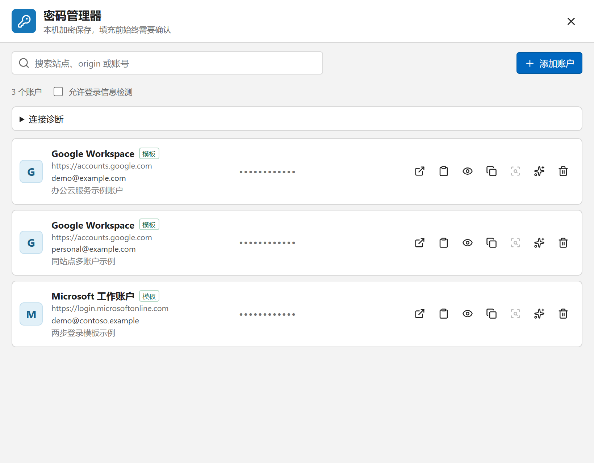
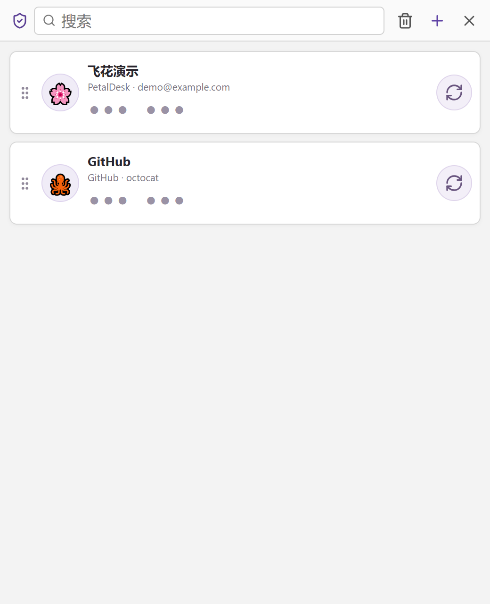

# 飞花 - PetalDesk

> 把想法留在桌面，把文件留在自己手里。

[产品网站](https://starsliao.github.io/PetalDesk/) · [GitHub](https://github.com/starsliao/PetalDesk) · [下载 Windows x64](https://github.com/starsliao/PetalDesk/releases/download/v0.7.1/PetalDesk_0.7.1_x64-setup.exe) · [下载 macOS Universal](https://github.com/starsliao/PetalDesk/releases/download/v0.7.1/PetalDesk_0.7.1_universal.dmg)

飞花 - PetalDesk 是一款面向 Windows 10/11 与 macOS 12+ 的本地便签与效率工具。它启动快、界面安静，支持 Markdown 即时排版、纯文本、图片、搜索、回收站，以及截图、任务规划和本地 MFA 验证器等随时可以唤起的小工具。没有账号、没有云端依赖，内容保留在你的本地数据目录中。

<p align="center">
  
</p>

## 一张便签，按你的方式记录

- Markdown 与纯文本两种模式，每张便签可以独立选择；默认样式只影响新建便签。
- Typora 风格的即时排版，支持标题、列表、任务清单、表格、链接、图片、代码、高亮和分隔线；链接可以 `Ctrl+左键` 或右键菜单跳转，表格中也可以使用安全的 `` 图片标签。选中文本即可自动复制，摘录内容不需要再按快捷键。
- 标题、颜色、置顶、只读、窗口位置和大小都可以单独保存；独立便签窗口右上角提供便签列表入口，可以直接切换到其他便签。
- 便签关闭后继续驻留托盘；双击托盘图标默认打开首个便签，`Alt` / `Ctrl` / `Shift` + 双击默认打开甘特图、MFA 与主界面。四组动作都能改绑到首个便签、最近便签、主界面或任一小工具；桌面快捷方式启动及重复打开会执行同一项“双击”设置。
- 删除前二次确认，删除后进入回收站；正文支持撤回、重做和自动保存。

<p align="center">
  
</p>

## 不只是便签

| 任务甘特图 | 截图与长截图 |
| --- | --- |
|  |  |

| 密码管理器 | MFA 验证器 |
| --- | --- |
|  |  |

### 0.7.1 平台支持

`0.7.1` 将远程桌面与录屏的敏感窗口保护改为可选设置：默认在远程桌面会话中也允许打开 MFA 验证器与密码管理器，窗口内容不再对截图和录屏隐藏；需要旧行为时可在 设置 > 隐私与安全 中开启"保护敏感窗口"。`0.7.0` 为 Firefox 扩展新增站点账户数角标与诊断/账户弹窗，弹窗中点击账户即可在当前页发起填充；登录检测现在支持"保存为新账户或选择更新任一既有账户"，保险库支持浏览器后台会话，密码窗口关闭时角标、捕获与填充仍可用，手动锁定后立即停止。Firefox"与扩展开发者分享身份验证信息"改为安装时必要权限，不再要求工具栏二次授权；同时修复了密码通道假健康、超时误杀连接和重复广播造成的卡顿。`0.6.3` 修复 Firefox 原生消息通道断开后造成的飞花卡顿、密码权限误报和扩展按钮无反馈，并为通道握手与重连增加超时保护。`0.6.2` 已修复密码管理器图标提示、窗口关闭和手动锁定交互，取消闲置 15 分钟自动锁定；远程桌面会话中不再打开会被系统隐藏的 MFA 与密码管理器窗口，而是直接说明原因并提示回到本机使用。

| 能力 | Windows 10/11 x64 | macOS 12+（Intel / Apple Silicon） |
| --- | --- | --- |
| 便签、甘特图、计时器、提醒 | 支持 | 支持 |
| MFA 本机免密保护 | Windows DPAPI | macOS Keychain |
| 密码管理器 | 支持；Firefox 扩展提供账户角标、诊断弹窗、确认后填充与登录信息检测 | 当前版本暂不支持 |
| 普通区域截图、标注、复制、保存、贴图 | 支持 | 支持；首次使用需授予“屏幕录制”权限 |
| 长截图、浏览器增强 / Native Messaging | 支持 | 当前版本暂不支持 |
| 安装包 | Windows x64 联网安装 EXE | 一个 Universal DMG，同时支持 Intel 与 Apple Silicon |

- 计时器：透明电子管数字、暂停/重置记录、透明度、位置和大小记忆。
- 提醒：一次、间隔、日/周/月/年周期，到点发送系统通知。
- 任务甘特图：任务排序、进度筛选、时间条拖动、小时级时间轴缩放。
- MFA 验证器：支持标准 `TOTP`、屏幕二维码扫描、图片/链接/手动导入，也支持一行一个链接批量导入并为批量账户随机搭配图标。验证码默认隐藏、双击安全复制，账户可拖动排序或通过右键置顶/取消置顶。单项可从右键菜单安全导出，经恢复密码验证后提供 Base32 密钥、完整 `otpauth://` 链接和二维码；删除项保留在 MFA 加密回收站中，可恢复，永久删除或清空前均需二次确认。
- 密码管理器：使用独立的 XChaCha20-Poly1305 保险库保存多个站点账户，共享 MFA 恢复密码并由 Windows DPAPI 日常解锁。Firefox 扩展角标会显示当前站点已保存的账户数量，点击图标可查看分层连接诊断和当前站点账户列表，并直接在当前页发起填充；填充始终需要页面浮层二次确认，绝不自动提交。开启登录信息检测后，登录成功会提示保存新账户；用户名或密码与已存账户不一致时，可选择保存为新账户或更新任一既有账户；完全一致的登录不会打扰。密码窗口关闭时这些能力仍可用，在密码管理器中手动锁定后立即停止。凭据只通过当前用户可访问的本机内存通道传递，不写入浏览器存储或截图文件队列。
- 截图：默认 `F1`，在飞花窗口内外都可直接唤起；Windows 与 macOS 均支持单显示器手动框选、标注、马赛克、模糊、复制、保存和置顶贴图，选区内双击即可复制，选区外右键直接取消。
- Windows 长截图：默认由用户在原窗口中手动滚动并实时拼接，支持暂停、重试、回退和完整标注；自动滚动作为高级模式保留。**安装浏览器扩展后不需要对扩展做任何操作**：飞花里的长截图操作完全不变，当目标是 Chrome、Edge 或 Firefox 长页面并使用自动滚动模式时，飞花会自动启用浏览器增强引擎，滚动定位与拼接更稳定；扩展本身没有、也不需要任何长截图操作入口。macOS 当前版本不提供长截图和浏览器联动。

Windows 长截图的默认操作只有三步：按 `F1` 框选固定区域并点击工具栏中的长截图按钮；冻结画面切回原窗口后，选区外仍保留暗色遮罩，直接在选区内向下滚动；控制条帧数增长后，点击“完成”。无需再次点击选区，普通 Windows 窗口也不需要安装浏览器扩展。向上滚动只会回看已捕获内容，不会反向写入长图；重新向下越过已捕获末尾后会自动继续拼接。采集会跟随真实滚动连续取帧，并在停止滚动后补一张稳定帧；空闲等待不会自动结束。需要自动滚动时，从长截图按钮旁的小箭头选择自动模式，再点击选区内真正会滚动的正文区域。

## 数据真正属于你

安装时可以选择“飞花 - PetalDesk 数据存储”，默认位置是用户“文档”目录下的 `PetalDesk`。便签、附件、设置和普通小工具数据迁移到新电脑时，复制整个目录，再在安装器或设置中指定它即可。存储按“本地读多、写入很少”设计；坚果云、OneDrive 等同步目录只作为可选的文件搬运方式，不依赖专有同步协议。

```text
PetalDesk/
└─ .petaldesk/
   ├─ notes/<note-id>/
   │  ├─ note.md
   │  ├─ meta.json
   │  └─ assets/
   ├─ config.json
   ├─ state/
   ├─ tools/
   │  ├─ gantt/
   │  │  ├─ gantt.json     # 版本化任务快照
   │  │  ├─ backups/
   │  │  └─ conflicts/
   │  ├─ mfa/
   │  │  ├─ vault.json     # 本机保护 + 恢复密码包装的 AEAD 加密保险库
   │  │  ├─ backups/
   │  │  └─ conflicts/
   │  └─ passwords/
   │     ├─ vault.json     # 独立的密码保险库
   │     ├─ backups/
   │     └─ conflicts/
   ├─ backups/
   ├─ journal/
   ├─ trash/
   └─ conflicts/
```

`note.md` 是正文唯一真相，本地图片使用便签目录内 `assets/` 的相对路径。Markdown 图片和受控的 HTML `` 标签也可以加载经过安全过滤的 HTTP/HTTPS 外链图片，并使用 `no-referrer` 策略避免发送来源地址；脚本、事件属性、`file:`、`javascript:`、协议相对地址和任意本地路径仍会被拦截。普通读取不会改写笔记；搜索索引按内容哈希增量维护且随时可以重建，不会成为迁移或恢复的前置条件。甘特图不保存为同步服务准备的删除墓碑或操作日志，只保留当前快照。

所有权威文件都采用同目录临时文件、磁盘刷新和原子替换。便签提交同时校验版本和正文哈希；甘特图与 MFA 保存前校验启动时读取的文件指纹。检测到外部替换时不会静默覆盖，而是将待保存内容写入 `conflicts/`，由用户决定保留哪一版。甘特图与 MFA 保留最近 5 份写前备份。旧版本布局可在 Windows 上使用 [`scripts/migrate-petaldesk-storage.ps1`](scripts/migrate-petaldesk-storage.ps1) 迁移，完整取舍见 [本地存储设计](docs/storage.md)。

MFA 与密码管理器同样可以随整个数据目录迁移。首次启用任一保险库时需要设置全局恢复密码；另一个保险库首次启用时输入同一个密码完成绑定。保险库正文分别由随机密钥进行 XChaCha20-Poly1305 认证加密，各自的数据密钥由基于 Argon2id 的全局恢复密码包装，同时保留当前平台的本机免密包装：Windows 使用 DPAPI，macOS 使用 Keychain。复制目录到另一台电脑、另一个系统用户或另一平台后，输入一次恢复密码即可解锁，并为新环境绑定本机保护；已有的另一平台包装会继续保留。导出单项 MFA 密钥也必须重新验证恢复密码；恢复密码不会保存，保险库、加密回收站、备份和冲突副本都不会降级为明文。忘记恢复密码且原设备已不可用时，只能使用各服务提供的账户恢复码。

### 升级与兼容

Windows 上的 `0.5.2` 是自动更新桥接版本；已安装该版本或更高版本的用户可直接在飞花内更新到 `0.7.1`，无需重新运行本地安装流程。macOS 的 `0.5.0` 是首个公开版本，`0.7.1` 可以直接覆盖升级，但当前仍使用手动下载安装。首次启动时会自动识别旧的 `飞花/.feihua` 存储布局、旧便签元数据和旧甘特图数组格式，转换到当前 `.petaldesk/` 结构；便签正文 `note.md` 不会被改写，甘特图转换前会保留迁移备份。同机升级不需要输入全局恢复密码；恢复密码由 MFA 与密码管理器全局共用，用于跨设备恢复两个保险库，以及主动导出单个 MFA 账户。旧数据损坏或格式版本过新时，飞花会保留原文件并阻止静默覆盖。

## 安装与运行

Windows 新用户可下载 [Windows x64 安装包](https://github.com/starsliao/PetalDesk/releases/download/v0.7.1/PetalDesk_0.7.1_x64-setup.exe) 后按向导操作。安装器会检查 WebView2；缺少时从微软官方地址显示进度并下载、静默安装，然后继续安装飞花 - PetalDesk。联网安装包因此更小。`0.5.2` 起默认开启自动检查与后台下载；“关于飞花 - PetalDesk”中可以手动检查或关闭自动更新，下载完成后仍由用户选择何时重启安装。

没有 WebView2 或下载权限时，安装器会明确提示失败原因，不会静默留下无法启动的程序。未签名构建可能显示“未知发布者”，这是 Windows 对代码签名的正常提示。

macOS 用户下载 [Universal DMG](https://github.com/starsliao/PetalDesk/releases/download/v0.7.1/PetalDesk_0.7.1_universal.dmg)，将应用拖入“应用程序”即可。同一个 DMG 同时包含 Intel（x86_64）和 Apple Silicon（arm64）代码，不需要按芯片下载不同安装包。普通截图首次使用时，请在“系统设置 > 隐私与安全性 > 屏幕录制”中允许 PetalDesk；未签名、未公证的测试构建可能被 Gatekeeper 阻止，正式发布方式见 [`docs/publishing.md`](docs/publishing.md)。

Windows 安装包已经包含长截图和密码管理器所需的 Native Messaging Host。首版密码自动填充与登录检测只由 Firefox 扩展提供；安装器不会静默安装扩展，用户需从 [Firefox 扩展安装页](https://starsliao.github.io/PetalDesk/firefox.html) 进入 AMO 并确认安装。不安装扩展仍可在密码管理器中打开站点、复制凭据并使用 Windows 通用长截图；安装后无需任何额外操作，浏览器长页面会在自动滚动模式下自动获得更稳定的滚动定位和拼接效果。macOS 版本不安装 Native Messaging Host，也不提供密码管理器、长截图或浏览器增强模式。

## 技术栈

- Rust stable + Tauri 2：文件、窗口、托盘、截图、剪贴板、通知和本地 IPC。
- Svelte 5 + TypeScript：主界面、便签和小工具。
- CodeMirror 6：Markdown/纯文本编辑、中文输入法、撤回与重做。
- Firefox 扩展：在 Windows 上提供长截图协作，以及站点账户数角标、连接诊断与账户弹窗、经用户确认的密码填充和登录信息检测；Chrome、Edge 首版继续只用于长截图。
- 系统 WebView：Windows 使用 WebView2，macOS 使用 WKWebView，避免 Electron 自带 Chromium 的体积。

## 开发

环境：Rust stable、Node.js、pnpm；Windows 开发需要 WebView2 Runtime，macOS 构建需要 macOS 12+ 与 Xcode Command Line Tools。

```powershell
pnpm install
pnpm tauri dev
```

只看浏览器演示界面：

```powershell
pnpm dev
```

浏览器模式不会读写桌面版数据目录；便签等演示数据可以使用独立的 `localStorage`，MFA 验证器只使用内存模拟数据，也不会保存输入的密钥。

常用检查：

```powershell
pnpm check
pnpm test
pnpm build
cargo fmt --all --manifest-path src-tauri/Cargo.toml -- --check
cargo test --manifest-path src-tauri/Cargo.toml --offline
```

生成 Windows x64 联网安装包：

```powershell
pnpm package:windows
```

在 macOS 上生成同时支持 Intel 与 Apple Silicon 的 Universal DMG：

```bash
rustup target add x86_64-apple-darwin aarch64-apple-darwin
pnpm package:macos
```

没有 Mac 时，可推送 `v*` 标签，由 GitHub Actions 的 macOS Runner 构建 Universal DMG；签名、公证与未签名构建限制见 [`docs/publishing.md`](docs/publishing.md)。

更完整的架构、发布和目录说明见 [`docs/README.md`](docs/README.md)。
