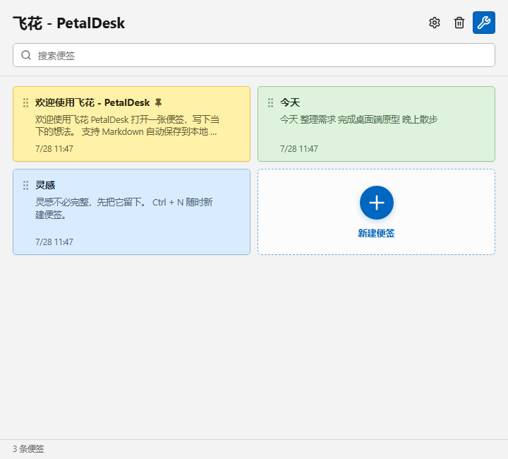
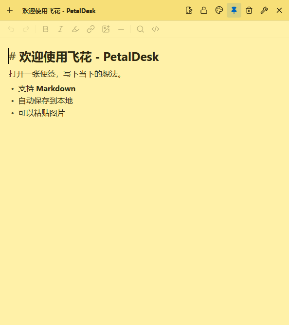
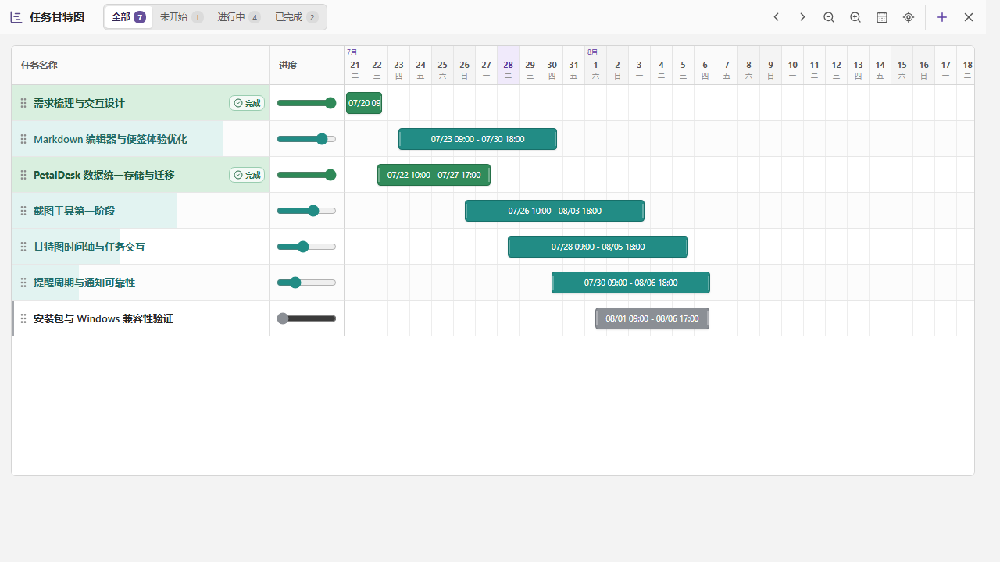
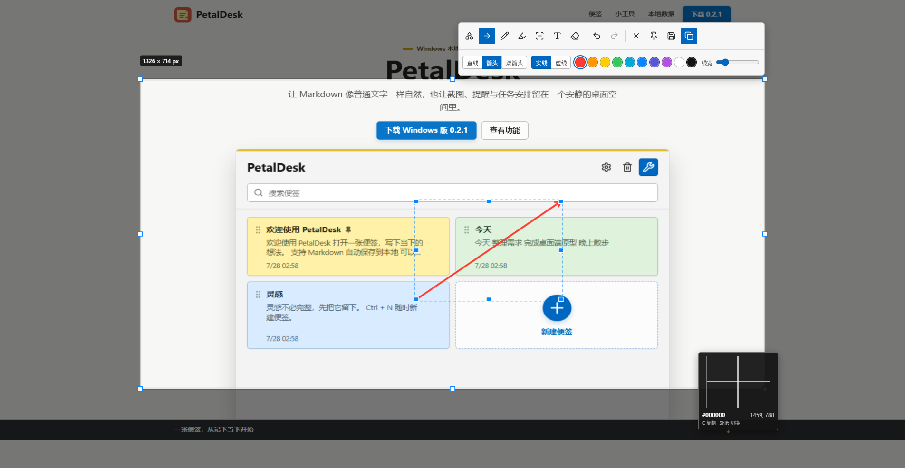

# 飞花 - PetalDesk

> 把想法留在桌面，把文件留在自己手里。

[产品网站](https://starsliao.github.io/PetalDesk/) · [GitHub](https://github.com/starsliao/PetalDesk) · [下载 Windows 安装包](https://github.com/starsliao/PetalDesk/releases/download/v0.3.3/PetalDesk_0.3.3_x64-setup.exe)

飞花 - PetalDesk 是一款 Windows 10/11 本地便签与效率工具。它启动快、界面安静，支持 Markdown 即时排版、纯文本、图片、搜索、回收站，以及几个随时可以唤起的小工具。没有账号、没有云端依赖，内容就是你目录里的 Markdown 文件。

<p align="center">
  
</p>

## 一张便签，按你的方式记录

- Markdown 与纯文本两种模式，每张便签可以独立选择；默认样式只影响新建便签。
- Typora 风格的即时排版，支持标题、列表、任务清单、链接、图片、代码、高亮和分隔线。
- 标题、颜色、置顶、只读、窗口位置和大小都可以单独保存。
- 便签关闭后继续驻留托盘；双击托盘图标直接打开上次使用的便签，右键可打开列表。
- 删除前二次确认，删除后进入回收站；正文支持撤回、重做和自动保存。

<p align="center">
  
</p>

## 不只是便签

| 任务甘特图 | 截图与长截图 |
| --- | --- |
|  |  |

- 计时器：透明电子管数字、暂停/重置记录、透明度、位置和大小记忆。
- 提醒：一次、间隔、日/周/月/年周期，到点发送 Windows 通知。
- 任务甘特图：任务排序、进度筛选、时间条拖动、小时级时间轴缩放。
- 截图：默认 `F1`，单显示器手动框选，标注、马赛克、模糊、复制、保存和置顶贴图；选区内双击即可复制，选区外右键直接取消。
- 长截图：默认由用户在原窗口中手动滚动并实时拼接，支持暂停、重试、回退和完整标注；自动滚动作为高级模式保留，浏览器扩展可增强 Chrome、Edge 与 Firefox 长页面的滚动定位和拼接稳定性。

长截图的默认操作只有三步：按 `F1` 框选固定区域并点击工具栏中的长截图按钮；冻结遮罩消失后，直接在露出的资源管理器、系统设置、表格列表、浏览器或其他原窗口中向下滚动；控制条帧数增长后，点击“完成”。无需再次点击选区，普通 Windows 窗口也不需要安装浏览器扩展。采集会跟随真实滚动连续取帧，并在停止滚动后补一张稳定帧；空闲等待不会自动结束。需要自动滚动时，从长截图按钮旁的小箭头选择自动模式，再点击选区内真正会滚动的正文区域。

## 数据真正属于你

安装时可以选择“飞花 - PetalDesk 数据存储”，默认位置是用户“文档”目录下的 `PetalDesk`。迁移到新电脑时，复制整个目录，再在安装器或设置中指定它即可。

```text
PetalDesk/
└─ .petaldesk/
   ├─ notes/<note-id>/
   │  ├─ note.md
   │  ├─ meta.json
   │  └─ assets/
   ├─ config.json
   ├─ state/
   ├─ tools/
   ├─ backups/
   ├─ journal/
   ├─ trash/
   └─ conflicts/
```

`note.md` 是正文唯一真相，图片使用便签目录内的相对路径。搜索索引可以重建，不会成为迁移或恢复的前置条件。旧版本布局可用 [`scripts/migrate-petaldesk-storage.ps1`](scripts/migrate-petaldesk-storage.ps1) 迁移。

## 安装与运行

下载 [Windows x64 安装包](https://github.com/starsliao/PetalDesk/releases/download/v0.3.3/PetalDesk_0.3.3_x64-setup.exe) 后按向导操作。安装器会检查 WebView2；缺少时从微软官方地址显示进度并下载、静默安装，然后继续安装飞花 - PetalDesk。联网安装包因此更小。

没有 WebView2 或下载权限时，安装器会明确提示失败原因，不会静默留下无法启动的程序。未签名构建可能显示“未知发布者”，这是 Windows 对代码签名的正常提示。

安装包已经包含长截图所需的 Native Messaging Host。浏览器增强模式还需要安装对应扩展；Firefox 面向普通用户的扩展必须经过 AMO 签名，具体发布方式见 [`docs/publishing.md`](docs/publishing.md)。不安装扩展仍可使用通用长截图。

## 技术栈

- Rust stable + Tauri 2：文件、窗口、托盘、截图、剪贴板、通知和本地 IPC。
- Svelte 5 + TypeScript：主界面、便签和小工具。
- CodeMirror 6：Markdown/纯文本编辑、中文输入法、撤回与重做。
- Chrome、Edge、Firefox 扩展：为浏览器长页面提供稳定的滚动控制和页面状态协作。
- 系统 WebView2：Windows 桌面渲染，避免 Electron 自带 Chromium 的体积。

## 开发

环境：Rust stable、Node.js、pnpm 和 Windows WebView2 Runtime。

```powershell
pnpm install
pnpm tauri dev
```

只看浏览器演示界面：

```powershell
pnpm dev
```

浏览器模式使用独立的 `localStorage` 演示数据，不会读写桌面版数据目录。

常用检查：

```powershell
pnpm check
pnpm test
pnpm build
cargo fmt --all --manifest-path src-tauri/Cargo.toml -- --check
cargo test --manifest-path src-tauri/Cargo.toml --offline
```

生成 Windows x64 联网安装包：

```powershell
pnpm package:windows
```

更完整的架构、发布和目录说明见 [`docs/README.md`](docs/README.md)。
