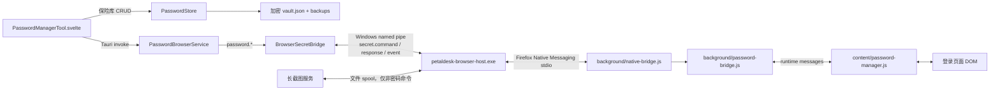
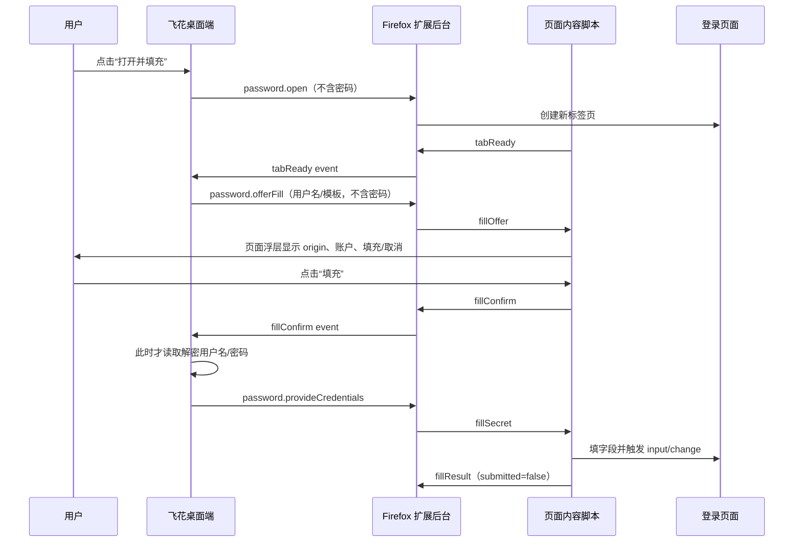

# 飞花密码管理器与 Firefox 扩展交接文档

> 交接时间：2026-08-05  
> 当前代码版本：`0.6.3`  
> 当前提交：`b02cf8e7cfed52bb72d06e3199b62b759050e1ad`（tag `v0.6.3`）  
> 目标读者：继续排查和修复此功能的开发者（Claude）

## 1. 当前结论

密码保险库、Firefox 扩展、Native Messaging Host 和 Windows 命名管道均已实现，但真实 Firefox 环境中的密码通信链仍不可靠。当前机器可以同时观察到以下状态：

- 飞花桌面端、Native Host 和 Firefox 扩展均为 `0.6.3`。
- Firefox 扩展已连接 Native Host，Native Host 仍在更新 session 心跳。
- 扩展声明了 `password-fill`、`password-capture` 和 `password.getStatus` 等 capability。
- Firefox 中的 `authenticationInfo` 权限已经授权。
- 点击 Firefox 工具栏中的飞花图标只显示 `OK`。
- 飞花密码管理器仍显示“Firefox 扩展通信异常；暂时无法读取密码权限状态”。

这些现象并不矛盾：**工具栏的 `OK` 目前只代表 `browser.permissions.getAll()` 返回了 `authenticationInfo`，完全不代表 Native Host、秘密命名管道或桌面端请求往返正常。**

`v0.6.3` 已修复多处阻塞、半开连接和轮询卡顿问题，相关单元测试和 CI 均通过，但用户现场仍可稳定遇到故障。这说明目前缺少真正覆盖“Firefox → Native Host → Windows named pipe → Tauri → 原路响应”的端到端测试和分层诊断信息。

### 1.1 必须优先修改：将 Firefox 的“与扩展开发者分享身份验证信息”设为必要

这里专指 Firefox 扩展安装/权限界面显示的选项 **“与扩展开发者分享身份验证信息”**，它对应 manifest 中的数据收集权限 `authenticationInfo`。这不是指飞花内部的“登录信息检测”开关，也不是泛指密码管理功能。这是用户已经明确决定的产品要求，不是待讨论选项：

> **最终要求：Firefox 所显示的“与扩展开发者分享身份验证信息”必须是必要权限。`authenticationInfo` 必须声明在 `required` 中，绝对不能继续声明在 `optional` 中，也不能在安装后再通过工具栏请求。**

| 项目 | 当前错误状态 | 必须实现的目标 |
| --- | --- | --- |
| Firefox 界面选项 | “与扩展开发者分享身份验证信息” | “与扩展开发者分享身份验证信息” |
| manifest 声明 | `optional`，运行时再请求 | 移入 `required`，删除 `optional` 声明 |
| 用户授权时机 | 先安装，再到飞花开启功能，最后点击 Firefox 工具栏二次授权 | 安装扩展时作为必要权限处理，不再要求工具栏二次授权 |
| 工具栏点击 | 用于请求/检查身份验证信息权限 | 改成真实连接诊断，不再承担权限授权 |
| 飞花 UI | 存在“等待 Firefox 授权”“授权后填充”状态 | 删除这些二次授权状态和文案 |

目标 manifest 为：

```json
"data_collection_permissions": {
  "required": ["websiteActivity", "authenticationInfo"]
}
```

Firefox 和 AMO 的具体界面由平台决定，但 manifest 必须让 **“与扩展开发者分享身份验证信息”** 成为必要项，而不是可选项；新安装的扩展不需要、也不允许再次通过工具栏申请 `authenticationInfo`。

这个权限配置问题与当前通信故障是两件事：现场“身份验证信息”已经授权，`password.getStatus` 仍无法完成桌面往返。因此必须同时完成“改成必选”和“修复 secret pipe 通信”，不能只改权限后就认为故障解决。

本文件只记录现状和后续修复要求。本次交接没有继续修改功能代码。

## 2. 用户当前看到的问题

### 2.1 密码管理器提示

```text
Firefox 扩展通信异常
暂时无法读取密码权限状态；登录信息检测暂未运行，飞花会自动重试。
```

此前也出现过：

```text
当前扩展不支持密码权限
请更新 Firefox 扩展；登录信息检测暂未运行。
```

`v0.6.3` 已把“明确不支持命令”和“传输异常”分开；当前主要复现的是后一种 `unknown` 状态。

### 2.2 Firefox 工具栏行为

点击扩展图标只看到约 3 秒的 `OK`，没有弹窗、诊断信息或其他界面。这是当前代码行为，因为 manifest 的 `action` 没有 `default_popup`，点击处理器只更新 badge 和 title。

### 2.3 性能问题

用户同时反馈飞花变卡。当前没有足够日志证明卡顿的唯一原因。需要优先验证以下可能性：

- `password.getStatus` 每次等待 2 秒后超时并退休 connection generation。
- secret connector 重连、`connectionReady` 同步和 UI 状态轮询发生反复抖动。
- `connectionReady` 后同步登录检测时连续发出多个同步请求，与状态查询并发争用同一通道。
- Native Host 外层主循环仍正常，但秘密通道 worker 已退出或卡住。

不要在没有性能采样和分层日志的情况下把卡顿归因于单一模块。

### 2.4 Firefox 重启后扩展消失

当前 Firefox profile 的 `extensions.json` 中没有检索到固定扩展 ID `petaldesk-capture@petaldesk.app`。这强烈提示当前扩展可能仍是通过 `about:debugging` 临时载入；临时扩展在 Firefox 重启后消失属于 Firefox 的预期行为。

最终验收必须使用 AMO 安装或 AMO 签名的持久 XPI，不能把临时载入结果当成正式安装结果。

## 3. 现场快照（2026-08-05）

以下信息是故障发生时的只读检查结果，PID、connection ID 和 pipe 名重启后会变化：

| 项目 | 现场值 |
| --- | --- |
| 桌面端版本 | `0.6.3` |
| Native Host 版本 | `0.6.3` |
| Firefox 扩展版本 | `0.6.3` |
| Firefox 扩展 ID | `petaldesk-capture@petaldesk.app` |
| Git commit | `b02cf8e7cfed52bb72d06e3199b62b759050e1ad` |
| Git tag | `v0.6.3` |
| Native Host 名称 | `com.petaldesk.capture` |
| 活跃 connection ID | `32b39cb7-6afc-41b2-97e0-ea69546eaf9f` |
| Native Host PID | `22028` |
| 飞花 PID | `8332` |
| session 心跳 | 持续更新 |
| secret endpoint | 存在，随机命名管道，token 已脱敏 |

Native Messaging 注册位置：

```text
HKCU\Software\Mozilla\NativeMessagingHosts\com.petaldesk.capture
```

注册表指向：

```text
C:\Users\cassmall\AppData\Local\PetalDesk\NativeMessaging\com.petaldesk.capture.firefox.json
```

Host 可执行文件：

```text
C:\Users\cassmall\AppData\Local\PetalDesk\petaldesk-browser-host.exe
```

Native Messaging manifest 的 allowlist 包含：

```text
petaldesk-capture@petaldesk.app
```

桌面秘密端点位于：

```text
C:\Users\cassmall\AppData\Local\PetalDesk\browser-bridge\secret-endpoint.json
```

现场随机管道示例：

```text
\\.\pipe\PetalDesk-password-cd2aac33-5d50-428d-ab9c-e4b3f7a947df
```

**绝对不要把 endpoint token、用户名、密码或凭据 payload 写入本文档、日志、测试快照或 issue。**

当前 session capabilities 包含：

```text
prepare
start
step
status
restore
cancel
password-fill
password-capture
password.open
password.offerFill
password.provideCredentials
password.cancelFill
password.requestConsent
password.setCaptureEnabled
password.captureMatch
password.saveResult
password.resolveCapture
password.startTemplateRecording
password.cancelTemplateRecording
password.getStatus
```

这里能证明 Firefox 与 Native Host 的 stdio 外层连接曾建立，但不能证明 Native Host 与桌面端之间的 secret pipe 仍健康。

## 4. 总体架构

### 4.1 组件关系



### 4.2 两条桌面通道

系统复用同一个 Firefox 扩展和同一个 Native Host，但桌面侧有两条不同通道：

1. **长截图旧通道**：使用 `%LOCALAPPDATA%\PetalDesk\browser-bridge` 下的 command/response 文件 spool。
2. **密码秘密通道**：使用带当前用户 ACL、随机 token、TTL 和进程校验的 Windows named pipe。

任何 `password.*` 命令以及 `secret.command` 都被明确拒绝进入文件 spool。因此：

- 长截图正常不代表密码通道正常。
- session 文件心跳正常也不代表 secret connector 正常。
- 修复时不能为了省事把用户名或密码写入旧文件 spool。

### 4.3 密码保险库

密码库实现位于 `src-tauri/src/passwords.rs`：

- 数据保存在用户选择的飞花数据目录下：`.petaldesk/tools/passwords/vault.json`。
- 保险库使用带 AAD 的加密 envelope，Windows 上的数据密钥由当前用户 DPAPI 保护。
- 有独立备份、冲突检测、原子写入和恢复流程。
- 列表接口只返回 `PasswordEntrySummary`，不返回密码。
- reveal、复制和浏览器填充按需读取敏感数据，短时保留后清理。
- 密码窗口关闭或手动锁定时清理解密状态、待处理填充/检测和敏感剪贴板状态。
- 不再采用“闲置 15 分钟自动锁定”。

全局恢复密码由 `src-tauri/src/recovery.rs` 协调，密码管理器和 MFA 验证器共用同一个恢复密码。修改恢复密码会以可回滚事务同步更新两个保险库。恢复密码无法找回，相关 UI 已提示其用途和遗忘风险。

### 4.4 远程桌面边界

MFA 和密码管理器属于敏感窗口。`src-tauri/src/commands.rs` 会在远程桌面会话中拒绝打开它们，并返回：

```text
remote_desktop_sensitive_window_unavailable
```

主界面应显示“远程桌面会隐藏敏感内容，因此当前不会打开窗口”的提示，而不是无响应。这一安全边界与当前 Firefox 通信故障无直接关系。

## 5. Firefox → Native Host → 桌面的启动协议

### 5.1 Firefox 建立 Native Messaging 连接

`browser-extension/src/background/native-bridge.js` 启动时执行：

```text
browser.runtime.connectNative("com.petaldesk.capture")
```

连接成功后，扩展首先发送：

```json
{
  "protocolVersion": 1,
  "type": "extension.ready",
  "browser": "firefox",
  "extensionVersion": "0.6.3",
  "extensionId": "petaldesk-capture@petaldesk.app",
  "capabilities": ["..."]
}
```

`src-tauri/src/browser_native_host.rs` 强制第一条消息必须是 `extension.ready`，并校验协议版本和浏览器类型。

### 5.2 Native Host 写 session 心跳

Native Host 为本次 stdio 连接生成 connection ID，在 browser bridge 目录写 session JSON，并每 2 秒刷新 `lastSeenUnixMs`。

session 心跳主要说明：

- Firefox 仍维持 Native Messaging Host 进程。
- Native Host 的外层主循环仍在运行。

它不说明：

- secret connector 线程仍存在。
- named pipe 握手成功。
- `password.getStatus` 可以完成往返。

### 5.3 桌面启动秘密端点

飞花启动 `BrowserSecretBridge` 时：

1. 创建随机 named pipe：`\\.\pipe\PetalDesk-password-<uuid>`。
2. 生成随机 token。
3. 写入 `%LOCALAPPDATA%\PetalDesk\browser-bridge\secret-endpoint.json`。
4. endpoint 包含协议版本、pipe 名、桌面 PID、过期时间和 token。
5. endpoint 定期刷新，token 随之轮换。

### 5.4 Native Host 连接秘密管道

Native Host 的 secret connector 读取 endpoint，打开 pipe 并发送：

```json
{
  "version": 1,
  "type": "secret.hello",
  "token": "<REDACTED>",
  "connectionId": "<native connection id>",
  "browser": "firefox",
  "processId": 22028
}
```

桌面端验证：

- 协议版本和 token。
- connection ID 和 browser。
- 声明 PID 与 named pipe 实际客户端 PID 一致。
- 客户端可执行文件名必须是 `petaldesk-browser-host.exe`。
- Host 必须与当前 `petaldesk.exe` 位于同一目录。

验证成功后桌面返回 `secret.ready`，并为该连接创建一个新的 generation。

### 5.5 命令与响应

桌面请求：

```json
{
  "version": 1,
  "type": "secret.command",
  "id": "<request uuid>",
  "protocolVersion": 1,
  "command": "password.getStatus",
  "payload": {}
}
```

路径如下：

```text
BrowserSecretBridge
  -> secret.command over named pipe
  -> Native Host
  -> Firefox Native Messaging stdio
  -> native-bridge.js
  -> password-bridge.js
```

扩展返回 `extension.response`，Native Host 转为 `secret.response`，桌面按 request ID 唤醒等待者。

页面事件则使用：

```text
content script
  -> password-bridge.js
  -> extension.event
  -> Native Host
  -> secret.event
  -> BrowserSecretBridge event queue
  -> PasswordBrowserService dispatcher
```

## 6. Firefox“与扩展开发者分享身份验证信息”权限问题

### 6.1 当前错误：Firefox 将“与扩展开发者分享身份验证信息”列为可选

文件：`browser-extension/manifest/firefox.json`

普通权限：

```json
"permissions": ["nativeMessaging", "tabs"]
```

页面权限：

```json
"host_permissions": ["<all_urls>"]
```

Firefox 数据权限：

```json
"data_collection_permissions": {
  "required": ["websiteActivity"],
  "optional": ["authenticationInfo"]
}
```

当前设计把 Firefox 界面中的 **“与扩展开发者分享身份验证信息”**（`authenticationInfo`）做成了可选权限。飞花先通过 `password.requestConsent` 把授权流程 armed 2 分钟，用户再点击 Firefox 工具栏图标触发：

```js
browser.permissions.request({ data_collection: ["authenticationInfo"] })
```

### 6.2 必须修改为安装时必选

**Firefox 的“与扩展开发者分享身份验证信息”（`authenticationInfo`）必须改成必要权限，不再保留 Firefox 工具栏二次授权。**

这里的“必选”含义必须严格执行：

- `authenticationInfo` 只能出现在 `data_collection_permissions.required` 中。
- `data_collection_permissions.optional` 中不得再出现 `authenticationInfo`。
- 扩展不得提供“稍后授权”“暂不授权”或单独撤销身份验证信息权限的产品流程。
- 不再调用 `browser.permissions.request({ data_collection: ["authenticationInfo"] })`。
- 用户拒绝 Firefox 的必要权限时，结果应是不能安装或启用扩展，而不是降级成一个仍可选择授权的扩展。

目标声明应类似：

```json
"data_collection_permissions": {
  "required": ["websiteActivity", "authenticationInfo"]
}
```

移除 `optional` 前必须用当前 Firefox/AMO 工具重新核对 required data collection permission 的最新 schema 和审核要求，但产品取舍已经确定：用户不接受运行时可选授权。安装或启用时如果用户不接受必要权限，扩展不应继续以“已经可以使用密码功能”的状态运行。

### 6.3 Firefox 必要权限不等于强制开启飞花登录检测

仍应保留飞花密码管理器中的“是否启用登录信息检测”产品开关：

- Firefox 的“与扩展开发者分享身份验证信息”（`authenticationInfo`）为必要项：代表扩展安装后具备实现密码填充/检测所需的数据权限。
- “登录信息检测”开关：代表用户是否允许飞花当前启用提交检测逻辑。

用户可以安装扩展并使用手动填充，但关闭自动检测。不要因为权限改为必选而强制始终检测网页登录提交。

### 6.4 必须删除的二次授权交互

新版本中，下列流程不应再出现：

- 飞花提示用户去 Firefox 工具栏完成“身份验证信息”授权。
- 用户点击工具栏后才调用 `browser.permissions.request()`。
- 两分钟 consent armed 状态。
- `action-required`、`toolbar-click`、“等待 Firefox 授权”和“授权后填充”等正常业务状态。
- 工具栏仅凭 `browser.permissions.getAll()` 显示整体 `OK`。

飞花内“允许登录信息检测”仍是一个独立功能开关，但切换它只应启用或停用页面提交检测，不应再触发 Firefox 权限申请。

### 6.5 改动范围

至少要同步修改：

- `browser-extension/manifest/firefox.json`
- `browser-extension/src/background/password-bridge.js`
- `browser-extension/src/background/native-bridge.js`
- `src-tauri/src/password_browser.rs`
- `src/lib/passwords.ts`
- `src/lib/components/PasswordManagerTool.svelte`
- 对应 Rust、TypeScript、Svelte 和扩展测试
- `browser-extension/README.md`
- `browser-extension/amo/PERMISSIONS.md`
- `browser-extension/amo/PRIVACY.md`
- `browser-extension/amo/LISTING.zh-CN.md`
- `browser-extension/amo/LISTING.en-US.md`
- `browser-extension/amo/REVIEWER_NOTES.md`
- AMO submission checklist 和截图说明

建议处理：

- 删除或重构 `CONSENT_ARM_TTL_MS`、`consentArmedUntil`、`armAuthenticationConsent()` 和工具栏中的 `permissions.request()`。
- `password.requestConsent` 可为旧桌面兼容暂时保留为只读/no-op，不能继续触发二次授权。
- `sync_capture_from_store()` 不再先请求 consent，再启用检测；应直接按飞花中的检测开关下发 `password.setCaptureEnabled`。
- 新版本不再正常产生 `action-required`、`toolbar-click` 和“授权后填充”状态。
- 工具栏按钮改成真实的分层连接诊断入口，或明确只显示权限状态；不能继续用单独一个 `OK` 暗示整体可用。

## 7. 为什么工具栏显示 `OK`，飞花仍显示通信异常

这是当前故障最重要的解释。

`browser-extension/src/background/password-bridge.js` 的工具栏点击逻辑分两种：

1. 没有 armed，或权限已经存在：只调用 `browser.permissions.getAll()`。
2. armed 且尚未授权：调用 `browser.permissions.request()`。

发现 `authenticationInfo` 后，它执行：

```text
setBadgeText("OK")
setBadgeBackgroundColor(green)
setTitle("飞花：密码权限已授权")
```

3 秒后清除 badge。

这个处理器没有验证：

- `nativePort` 是否仍连接。
- Native Messaging Host 是否健康。
- secret connector 是否仍运行。
- named pipe 是否已握手。
- 桌面端是否仍拥有对应 generation。
- `password.getStatus` 是否能完成请求/响应往返。
- 飞花是否收到 `consentChanged` 事件。

即使 `postEvent("consentChanged")` 因 Native Host 或 pipe 故障而发送失败，当前代码仍会显示 `OK`。`secretDisconnected` 只清理密码会话，不会撤销 Firefox 已授予的数据权限，因此这个组合可以长期存在。

当前扩展单元测试还把“已有权限时点击显示 `OK`”固化为预期行为。修复后应重写该测试，验证 badge/popup 展示的是分层健康状态，而不是单一权限状态。

## 8. `password.getStatus` 与桌面提示映射

### 8.1 扩展返回值

`password.getStatus` 当前返回：

```json
{
  "authenticationConsent": true,
  "consentActionRequired": null,
  "consentArmed": false,
  "captureEnabled": true,
  "pendingCandidates": 0,
  "pendingUsernameStages": 0,
  "pendingFillSessions": 0,
  "pendingTemplateRecordings": 0
}
```

该命令内部首先调用 `browser.permissions.getAll()`。

### 8.2 Rust 状态查询

`PasswordBrowserService::status()`：

1. 选择最新的 Firefox secret connection。
2. 发送 `password.getStatus`。
3. 最多等待 2 秒。
4. 请求失败时重新检查 connection 是否仍存在。

映射规则：

| 条件 | `capturePermission` |
| --- | --- |
| `authenticationConsent == true` | `granted` |
| `authenticationConsent == false` | `action-required` |
| 已知扩展连接，但请求失败或缺少布尔值 | `unknown` |
| 明确返回“不支持 password.getStatus” | `unavailable` |

### 8.3 前端轮询

`PasswordManagerTool.svelte`：

- 每 10 秒进行一次 completion-based 状态轮询。
- 使用 `browserStatusRefreshInFlight` 避免重叠轮询。
- `connected + unknown + captureEnabled` 显示当前“Firefox 扩展通信异常”。
- `connected + unavailable + captureEnabled` 显示“当前扩展不支持密码权限”。

`src/lib/passwords.ts` 的 `command()` 会把后端错误压缩成普通 `Error(message)`；`getBrowserStatus()` 又会捕获所有异常并返回统一的 `disconnected + unknown`。这会丢失 error code、失败层级、request ID 和原始原因，是当前诊断盲点。

另外，Rust 状态中的 `extensionVersion` 当前固定返回 `None`，而 `extensionInstalled` 和 `nativeHostInstalled` 又都由同一个 `known_extension` 推断，UI无法真正区分：

- 扩展未安装。
- Native Host 未注册。
- stdio 已连接但 secret pipe 未连接。
- pipe 已连接但请求超时。

## 9. 打开并填充交互

### 9.1 正常流程



### 9.2 安全约束

- `password.open` 和 `password.offerFill` 不携带密码。
- 用户必须在目标网页浮层再次点击“填充”。
- 凭据只在确认后由桌面端读取并一次性发送。
- 只填充字段并触发必要的 `input/change`，绝不自动提交。
- session 绑定 connection、tab、top frame、document、entry 和精确 origin。
- 跨 origin 重定向、错误 tab/frame、过期 session 和歧义字段全部拒绝。
- HTTP 默认拒绝，必须在账户中逐 exact origin 明确允许。
- 两步登录允许在同一 tab 和允许的 exact origin 内继续下一阶段。
- 凭据不得写入扩展 storage、浏览器 storage、文件 spool或日志。

### 9.3 模板优先级

```text
用户录制模板 > 内置模板 > 通用启发式
```

字段识别仍有歧义时必须失败关闭，不能猜字段或提交页面。

## 10. 内置站点模板

文件：`browser-extension/src/shared/password-templates.js`

| 模板 | 精确 origin | 模式 |
| --- | --- | --- |
| Google | `https://accounts.google.com` | 两步登录 |
| Microsoft 工作/学校 | `https://login.microsoftonline.com` | 两步登录 |
| Microsoft 个人 | `https://login.live.com` | 两步登录 |
| 阿里云 | `https://account.aliyun.com` | 账号密码 |
| 腾讯云 | `https://cloud.tencent.com` | 账号密码 |
| 华为云 | `https://auth.huaweicloud.com` | 账号密码 |

模板仅使用受约束的 CSS selector，不允许任意 JavaScript。真实站点页面随时会改版，静态 fixture 通过不能代替六个实际登录页面的人工/自动冒烟测试。

## 11. 登录信息检测、新增与更新

### 11.1 开启方式

首次进入密码管理器时，如果 `captureConfigured == false`，UI 显示：

- “开启检测”
- “暂不开启”

选择会持久化到密码库设置。当前版本开启后还会触发 Firefox 可选权限流程；按用户新要求改成必选权限后，只保留这个飞花产品级开关。

### 11.2 页面检测

内容脚本只在 top frame：

- 监听 form submit。
- 监听类似提交按钮的 click。
- 识别单页登录、两步用户名/密码和密码修改场景。
- 两步用户名阶段只在扩展内存保留最多 2 分钟。
- 完整候选凭据只在扩展内存保留最多 30 秒。
- 提交后约 900 ms 根据 URL 变化、登录框/密码框消失等信号判断。
- 有较强成功信号时给高置信度；无法确认时以低置信度询问用户是否刚刚登录成功。
- pagehide、tab 关闭、断开、超时或忽略都会清理候选。

### 11.3 当前实际匹配规则

实际实现在 `src-tauri/src/passwords.rs::capture_decision_at()`：

| 候选与保险库关系 | 动作 |
| --- | --- |
| 检测功能关闭 | 不提示 |
| 精确同 origin + 同用户名 + 同密码 | 完全相同，不提示 |
| 精确同 origin + 同用户名 + 密码不同 | 提示更新 |
| 用户名非空，但找不到同 origin + 同用户名账户 | 提示新增 |
| 用户名缺失，同 origin 无账户 | 不猜账户，提示手动处理 |
| 用户名缺失，同 origin 仅一个账户 | 提示更新该账户 |
| 用户名缺失，同 origin 多个账户 | 列出账户，让用户选择替换 |

补充：

- origin 是 scheme + host + port，忽略 path，但必须精确匹配。
- 用户名比较区分大小写，并使用 constant-time 比较。
- 密码比较使用 constant-time 比较。
- 完全相同的凭据不会弹窗。
- 新增/更新最终都必须由用户在网页浮层确认。

### 11.4 计划与当前实现的差异

`docs/PASSWD_PLAN.md` 写过“用户名不同提示新增，并允许手动替换已有账户”。当前实现中，**非空的新用户名只提供新增或忽略，不提供替换同 origin 旧账户的入口**。只有无法识别用户名且同 origin 有多个账户时，才会显示账户选择并执行替换。

Claude 修复通信问题时不要无意改变这条业务规则；若要补齐计划中的“手动替换”，应作为单独的产品行为修改并补测试。

## 12. `v0.6.3` 已尝试的修复

提交：`b02cf8e`，提交说明“发布 0.6.3：修复 Firefox 密码通道卡死”。

主要改动：

- secret bridge 队列从可能阻塞的 `send` 改成 `try_send`。
- 队列 Full、Disconnected、request timeout 和 writer failure 时退休对应 generation。
- 使用 `CancelSynchronousIo` 和 `DisconnectNamedPipe` 尝试关闭半开 pipe 和阻塞 worker。
- Native Host secret reader/writer 改为分线程监督。
- secret pipe 握手增加 2 秒超时。
- worker 停止增加重复 cancel、join deadline 和失败原因。
- `password.getStatus` 从前端主调用路径移到后台阻塞任务。
- UI 轮询从约 3 秒改为 10 秒 completion-based，禁止重叠。
- “明确不支持密码命令”与“传输错误”改成不同 UI 状态。
- 工具栏增加 3 秒 `OK`/`!` badge（但它只反映权限，现已证明容易误导）。
- 关闭密码窗口不再同步等待 Firefox 请求完成。

此前发布验证记录：

- Rust：`326 passed / 1 ignored`
- 前端：`330 passed`
- 扩展：`45 passed`
- Svelte check：`0 errors / 0 warnings`
- GitHub CI 和 Release 成功

这些结果说明局部逻辑和 mock 测试通过，**不能证明真实 Firefox 链路可用**。当前现场问题发生在这些验证之后。

## 13. 高价值故障假设（均未确认）

### 假设 A：外层 session 活着，secret connector 已永久退出

`start_secret_connector()` 在以下严重情况会直接 `return`：

- secret pipe 握手超时后线程无法停止。
- reader/writer worker 无法在 deadline 内停止。
- 某些 I/O exit 被标记为必须停止 connector。

但 Native Host 主循环仍可能继续刷新 session 心跳。因此桌面/安装检查会看到“扩展存在、Host 进程存在”，密码 pipe 却永久不可用。

这是目前最符合现场现象的假设之一。建议遇到 connector 无法恢复时，不要让外层 Host 继续伪装健康；应把 fatal 状态传播到主进程并让 Firefox 重新拉起 Host，或由可靠 supervisor 重建 connector。

### 假设 B：状态超时触发 generation 退休与重连抖动

`password.getStatus` 只等待 2 秒。超时会退休当前 generation。随后 Native Host 可能重连并发出 `connectionReady`，桌面又立即同步 capture 设置；UI 每 10 秒继续查询，可能形成“刚连上就超时并退休”的循环。

### 假设 C：`connectionReady` 同步命令与状态查询竞争

当前 `sync_capture_from_store()` 在登录检测开启时，会依次发：

1. `password.requestConsent`
2. `password.setCaptureEnabled`

与此同时密码窗口可能发 `password.getStatus`。需要用同一 connection/generation 上的 request ID 时间线确认是否有并发、队列满、响应错配或超时。

权限改为必选后，移除 `password.requestConsent` 也会减少一次不必要的同步往返，但不能把它当成没有证据的唯一根因。

### 假设 D：Native Host `try_send` 静默丢响应/事件

Native Host 将扩展事件和响应放入 secret outbound 队列时使用 `try_send`。队列满时部分路径直接忽略错误，`secret.response` 可能丢失，桌面只能等到超时。

必须区分：

- 允许丢弃的低价值诊断事件。
- 绝不能静默丢弃的 request response。

响应队列满时至少应记录不含秘密的结构化错误并让连接明确失败，而不是保持表面健康。

### 假设 E：多个 Firefox profile/连接选择错误

状态查询使用“最新 Firefox secret connection”，而填充连接选择要求环境明确。若多个 profile 或临时/正式扩展同时运行，用户点击工具栏的 profile 可能不是桌面正在查询的 profile。

现场当前只观察到一个 session，但仍应在干净单 profile 环境复现，并在 UI 明确展示 extension ID、version、connection ID 和 profile/Host PID。

### 假设 F：错误在多层被压成统一 `unknown`

扩展错误 code 在部分 pipe 转换中只保留 message；Native Host 多处错误直接忽略后重试；TypeScript 再次吞掉 Tauri error code。即使真实断点已经产生错误，最终 UI也只剩一个 `unknown`。

## 14. Claude 应先补的诊断能力

### 14.1 结构化日志字段

每一层至少记录以下非秘密字段：

- 时间戳。
- connection ID。
- generation。
- request ID。
- command 名称。
- browser、extension ID、extension version。
- Host PID、desktop PID。
- handshake/lifecycle 阶段。
- 请求入队、出队、写出、收到响应、完成或超时的时间。
- connection retirement/reconnect 原因。
- 队列长度或 Full/Disconnected 状态。

严禁记录：

- endpoint token。
- 用户名。
- 密码。
- `password.provideCredentials` payload。
- `captureCandidate` 的敏感内容。
- 解密 vault 数据。

对于敏感命令，只记录命令名、request ID、payload byte length 和成功/失败状态。

### 14.2 分层健康状态

桌面诊断接口/UI应分别显示：

1. Firefox 扩展是否安装、ID 和版本。
2. Native Messaging registry/manifest 是否存在。
3. Native Host 进程与 session 心跳是否新鲜。
4. Firefox stdio connection 是否存在。
5. secret endpoint 是否有效。
6. secret pipe 是否连接。
7. 当前 connection ID 和 generation。
8. secret connector 是否仍运行，是否曾永久退出。
9. 最近握手成功/失败时间和原因。
10. 最近 `password.getStatus` 请求/响应时间。
11. 最近 timeout、queue full、writer/reader exit 原因。

不要再用一个 `connection: connected` 同时代表上述全部状态。

### 14.3 工具栏诊断

工具栏当前 `OK` 必须重构。可选方案：

- 增加一个小 popup，分别显示“权限 / Native Host / 飞花桌面端 / 密码通道”。
- 或点击时发起有桌面 acknowledgement 的健康检查，只有完成真实往返才显示整体 `OK`。
- 若只能读取权限，则文字必须明确写“密码权限已授予”，不能写成整体健康。

`nativePort` 当前是 `native-bridge.js` 的私有状态，secret pipe lifecycle 也没有对 toolbar 暴露。需要设计共享诊断状态；Native Host 已能发 `secretConnected`/`secretDisconnected` lifecycle，但扩展目前只处理 `secretDisconnected`。

### 14.4 保留原始错误

- `src/lib/passwords.ts` 不要把所有 Tauri 错误只压成普通 message。
- 保留至少 `code`、`message`、`layer`、`requestId`、`connectionId`、`generation`。
- secret response 应保留扩展返回的 error code，不只保留 message。
- UI默认显示友好文案，诊断详情可复制，但必须自动排除秘密字段。

## 15. 建议排查顺序

1. 使用一个干净 Firefox profile，只安装一个持久扩展，确认重启 Firefox 后扩展 ID 仍存在。
2. 确认桌面端、Host、扩展版本完全一致，清除旧的临时扩展实例。
3. 打开 Firefox 扩展后台调试控制台和飞花分层日志。
4. 记录 `extension.ready`、session 创建、`secret.hello`、`secret.ready`、`connectionReady` 的完整非秘密时间线。
5. 手工连续执行至少 100 次 `password.getStatus`，确认每个 request ID 都有且只有一个 response。
6. 如果第一个请求就失败，按 stdio、connector、handshake、pipe writer、extension route、pipe reader 的顺序定位断点。
7. 如果运行一段时间后失败，重点检查 endpoint token 轮换、worker exit、generation 替换、queue full 和多 profile。
8. 分别重启 Firefox、飞花、Native Host，验证每种顺序都能自动恢复，且旧 generation 不会覆盖新 generation。
9. 再验证打开并填充、登录检测和模板录制。
10. 最后验证长截图没有回归，并进行卡顿/CPU/线程/句柄采样。

## 16. 建议的修复原则

- 先建立可观测性，再针对真实断点修复，避免继续凭 UI 文案猜测。
- secret connector 发生不可恢复 fatal 时，不得让 session 心跳继续代表整体健康。
- request response 不得静默丢弃；队列背压必须明确失败并可诊断。
- 避免在 connectionReady handler 内串行执行多个会互相触发状态变化的同步请求。
- 把权限、Native Host、secret pipe 和业务 command 状态拆开。
- 保持 password secret 只走内存 pipe；不要以修复健康检查为理由降低秘密边界。
- 可以评估把不含凭据的 health/status 命令放到独立控制通道，但 `password.provideCredentials`、capture 候选等敏感消息仍必须只走 secret pipe。
- 工具栏和桌面 UI必须展示同一套状态定义，避免一个显示 `OK`、另一个显示通信异常。

## 17. 必须保留的安全边界

无论如何修复，都必须保留：

- 密码不得写入文件 spool。
- 密码不得写入扩展 storage、localStorage、IndexedDB 或浏览器密码数据库。
- 密码、用户名和 token 不得进入普通日志。
- 页面填充前必须由用户在网页浮层再次确认。
- 扩展只填字段，不自动提交。
- HTTP 必须逐 exact origin 明确允许并持续警告。
- session、connection、generation、tab、top frame、document、origin、entry 和 offer/candidate 必须绑定校验。
- 页面导航或 origin 变化时失败关闭。
- 候选超时、页面关闭或通信断开时立即清理敏感内存。
- 保险库列表/状态接口不得返回密码。
- 远程桌面下不得绕过敏感窗口保护。

## 18. 测试现状与缺口

### 18.1 当前测试能覆盖什么

- Rust：vault、DPAPI/恢复、备份、匹配、pipe generation、部分 Windows named pipe 生命周期。
- TypeScript/Svelte：密码管理 UI状态和用户交互，但使用 mock `PasswordApi`。
- 扩展 Node 测试：权限、tabs、Native Port、content 脚本和模板逻辑，但 Firefox API由 `vm`/mock 模拟。
- 模板 fixture：静态 DOM，不是实际网站。

### 18.2 当前测试不能证明什么

- Firefox 真实 `runtime.connectNative`。
- Windows 注册表和 Native Messaging manifest 组合是否可用。
- 真实 Host 可执行文件 stdio framing。
- Host 到桌面随机 named pipe 的真实完整往返。
- Firefox required `authenticationInfo` 的真实安装/AMO 行为。
- AMO/XPI 安装后重启持久性和自动更新。
- 六个内置站点的真实页面兼容性。
- 页面提交 → 成功检测 → 桌面匹配 → 浮层 → 写 vault → saveResult 的全链路。
- 工具栏所谓 `OK` 是否真的代表桌面健康。

### 18.3 必须新增的端到端场景

- 干净 Firefox profile 安装签名 XPI，重启后扩展仍存在。
- 启动飞花后，在限定时间内完成 secret handshake。
- 连续 `password.getStatus` 无超时、无丢响应、无 generation 抖动。
- 先启动 Firefox/后启动飞花，以及相反顺序都能自动恢复。
- 强制结束飞花、Host 或 Firefox 后，状态准确且重启可恢复。
- 工具栏诊断与桌面诊断一致。
- 打开并填充：页面确认后填字段、不提交。
- 登录检测：相同不提示、密码变化更新、新用户名新增、缺用户名选择账户。
- HTTP 未授权拒绝、授权 exact origin 后才允许。
- 两步登录、SPA、密码修改、失败登录、低置信度确认和歧义字段。
- 长截图继续正常。
- 磁盘、扩展 storage、日志和测试输出中没有密码或 token。
- 长时间运行无明显 UI 卡顿、CPU 异常、线程/句柄泄漏。

## 19. 验证命令

仓库根目录：

```powershell
pnpm check
pnpm test
cargo test --manifest-path src-tauri\Cargo.toml
```

扩展目录：

```powershell
Set-Location browser-extension
npm test
npm run build
npm run package:firefox
```

单独构建 Windows Native Host：

```powershell
cargo build --manifest-path src-tauri\Cargo.toml --release --bin petaldesk-browser-host --features browser-native-host
```

AMO reviewer fixture：

```powershell
Set-Location browser-extension
node .\amo\reviewer-fixture\server.mjs
```

fixture 地址：

```text
http://127.0.0.1:43127/login
```

注意：运行上述单元测试仍不能代替真实 Firefox E2E。

## 20. 关键文件索引

### 计划与说明

- `docs/PASSWD_PLAN.md`：原始功能和发布计划。
- `browser-extension/README.md`：扩展开发说明。
- `browser-extension/native-host/windows/README.md`：Windows Native Host 注册说明。

### Firefox 扩展

- `browser-extension/manifest/firefox.json`：Firefox manifest、固定 ID 和权限。
- `browser-extension/src/shared/browser-api.js`：Firefox/Chromium API 适配器。
- `browser-extension/src/background/native-bridge.js`：Native Messaging 连接、stdio 命令路由、重连。
- `browser-extension/src/background/password-bridge.js`：密码 session、权限、填充/检测/模板协议。
- `browser-extension/src/content/password-manager.js`：页面浮层、字段填充、登录提交检测。
- `browser-extension/src/shared/password-templates.js`：内置模板、用户模板和通用字段识别。

### Tauri / Rust

- `src-tauri/src/passwords.rs`：加密保险库、CRUD、匹配规则、剪贴板和恢复支持。
- `src-tauri/src/recovery.rs`：MFA 与密码库的全局恢复密码事务。
- `src-tauri/src/password_browser.rs`：桌面浏览器业务状态、填充/检测事件编排。
- `src-tauri/src/browser_secret_bridge.rs`：Windows secret pipe、handshake、generation 和 request/response。
- `src-tauri/src/browser_native_host.rs`：Firefox Native Host、session 心跳、文件 spool 与 secret connector。
- `src-tauri/src/browser_bridge.rs`：长截图旧文件通道；明确拒绝 `password.*`。
- `src-tauri/src/commands.rs`：密码窗口、远程桌面敏感窗口限制。
- `src-tauri/src/lib.rs`：状态初始化、事件 dispatcher 和 Tauri command 注册。

### 前端

- `src/lib/passwords.ts`：类型、Tauri API封装和状态标准化。
- `src/lib/components/PasswordManagerTool.svelte`：密码管理器 UI、轮询和交互。
- `src/routes/+page.svelte`：密码管理器小工具窗口入口。

### 安装与 AMO

- `browser-extension/native-host/windows/Register-PetalDeskNativeHost.ps1`
- `browser-extension/native-host/windows/Unregister-PetalDeskNativeHost.ps1`
- `browser-extension/native-host/manifests/firefox.json.template`
- `browser-extension/scripts/package-firefox.ps1`
- `browser-extension/amo/PERMISSIONS.md`
- `browser-extension/amo/PRIVACY.md`
- `browser-extension/amo/LISTING.zh-CN.md`
- `browser-extension/amo/LISTING.en-US.md`
- `browser-extension/amo/REVIEWER_NOTES.md`

### 测试

- `browser-extension/test/native-bridge.test.cjs`
- `browser-extension/test/password-bridge.test.cjs`
- `browser-extension/test/password-manager.test.cjs`
- `browser-extension/test/password-templates.test.cjs`
- `src/lib/passwords.test.ts`
- `src/lib/components/PasswordManagerTool.test.ts`
- Rust 单元测试位于上述各 `.rs` 文件的 `#[cfg(test)]` 模块。

## 21. Claude 完成修复的验收标准

以下条件全部满足才算完成，不以 CI绿色为唯一标准：

1. Firefox 界面中的“与扩展开发者分享身份验证信息”（`authenticationInfo`）已从 optional 移入 required，显示为必要而不是可选；安装后不存在工具栏二次授权，所有 AMO 文案、测试和 UI同步更新。
2. Firefox 工具栏不再以权限 `OK` 冒充整体通信健康。
3. 干净 profile 中使用持久扩展，重启 Firefox 后扩展仍存在。
4. 桌面 UI能分别展示扩展、Native Host、session、secret pipe 和业务请求状态。
5. 真实 `password.getStatus` 能稳定完成全链路往返，连续测试无超时/丢响应。
6. 任一组件重启或异常退出后能够自动恢复，不留下“心跳正常但 connector 已死”的假健康状态。
7. 飞花密码管理器不再持续显示 `unknown`，且无明显卡顿。
8. 打开并填充在页面二次确认后成功，只填字段、不提交。
9. 登录检测的新增/更新/相同/多账户规则均通过真实链路测试。
10. 长截图功能无回归。
11. 所有单元、集成和真实 Firefox E2E通过。
12. 磁盘、浏览器 storage、日志和诊断导出中均不存在密码、用户名、token 或敏感 payload。

## 22. 最后提醒

当前最容易走偏的地方是继续围绕 Firefox 权限反复修改。现场已经证明权限存在，工具栏也能读到权限；真正需要定位的是 `password.getStatus` 在 secret pipe 全链路中的断点。

建议第一步不是再改超时或重连参数，而是把 connection ID、generation、request ID 和 lifecycle reason 从扩展到桌面完整串起来。只有拿到一条失败请求的精确时间线，才能判断是 connector 永久退出、响应被丢弃、generation 抖动、并发争用还是多 profile 选错连接。

## 23. v0.7.0 已完成的修复

版本 `0.7.0` 已落地以下变更，对应第 21 节验收标准的代码部分：

1. **`authenticationInfo` 改为 required**：数据收集权限在 `browser-extension/manifest/firefox.json` 中从 optional 移入 required，安装扩展时由 Firefox 一次性授予；删除全部“工具栏点击二次授权”流程（无 consent arm、`password.requestConsent` 为 no-op、不再发送 `consentRequired`/`consentChanged` 事件）。
2. **角标账户数**：浏览网站时扩展角标显示该站点已保存账户数（桌面端按精确 origin 匹配推送 `password.updateBadge`）；tab 切换、导航、保险库增删改自动刷新；手动锁定后不显示。
3. **工具栏 popup**：`action.default_popup = popup/popup.html`，提供分层诊断（安装权限 / Native Host stdio / 桌面密码通道 / 最近请求 / 扩展版本）、当前站点账户列表、点击账户在当前页发起填充（仍需页面浮层二次确认）以及“打开飞花密码管理器”按钮。
4. **捕获提示增强**：用户名与已存账户都不同时，浮层同时提供“保存为新账户”和“更新既有账户（可选哪个账户）”；保险库手动锁定时浮层提示已锁定（captureMatch action `locked`）。
5. **浏览器后台会话**：扩展连接后即使密码窗口关闭，捕获 / 填充 / 角标仍可用（DPAPI 自动解锁）；手动锁定立即停止。
6. **可靠性**：`password.getStatus` 超时先 ping 探测，不再单次超时就杀连接；Native Host secret connector 发生不可恢复故障时进程退出（由 Firefox 自动重拉），消除“心跳正常但通道已死”的假健康；Host 写 `browser-bridge/host-diagnostics.log` 单行 JSON 诊断（无秘密）；桌面端 status 提供分层字段（`stdioConnected`/`pipeConnected`/`diagnostics`/`lastRequestOutcome`/`extensionVersion`）；capture 同步幂等。
7. **桌面 UI**：删除“等待 Firefox 授权”等状态；新增连接诊断区块和复制诊断信息按钮。
8. **协议**：新增事件 `originActive`/`fillRequest`/`openPasswordManager`；命令 `password.updateBadge`/`password.offerFillDirect`；captureMatch action 增加 `locked`；`new` 可带 accounts；saveDecision `replace` 在 `new`/`select` 下均合法。

### 剩余风险

- 真实 Firefox E2E（安装授权展示、角标、popup、全链路填充/捕获、重连恢复）仍需人工在真实浏览器中执行，单元与集成测试不覆盖。
- 六个内置站点模板（Google、Microsoft、阿里云、腾讯云、华为云等）未做真实站点冒烟，选择器可能随站点改版失效。

## 24. 远程桌面敏感窗口保护改为可选（产品决策变更）

第 17 节原将“远程桌面下不得绕过敏感窗口保护”列为必须保留的安全边界。产品负责人已明确变更该要求：自 `0.7.1` 起，新增“保护敏感窗口”设置项（`WorkspaceStore::protect_sensitive_windows`，持久化于数据目录 `config.json`），**默认关闭**——远程桌面会话中允许打开 MFA 验证器与密码管理器，窗口内容也不再对截图、录屏和屏幕共享隐藏（不应用 `WDA_EXCLUDEFROMCAPTURE`）。开启后恢复原行为：远程桌面拒绝打开敏感窗口（`remote_desktop_sensitive_window_unavailable`）且窗口内容对捕获隐藏。设置入口在 设置 > 隐私与安全；切换时对已打开的敏感窗口即时应用/清除 display affinity，无需重启。
